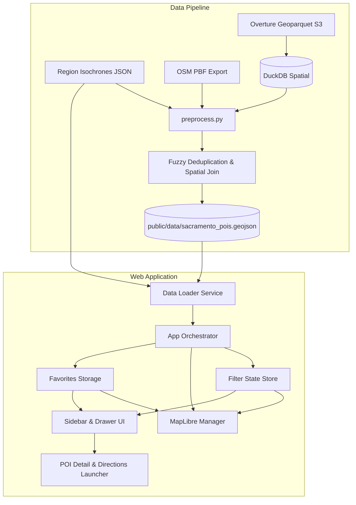

# Requirements

### Overview & Goals
The ConferenceWalker project is designed to help conference attendees quickly discover and navigate to nearby points of interest (POIs) around a conference venue. Starting from a regional walking isochrone file (such as `regions/Walksheds of Sacramento FOSS4GNA 2026.json`), the solution provides:
1. An automated, reproducible data preprocessing pipeline that ingests data from both OpenStreetMap (PBF export) and Overture Maps (Geoparquet on S3), tags POIs with approximate walking distances from the conference center based on walking isochrones, deduplicates overlapping records, preserves comprehensive attributes, and outputs standardized GeoJSON.
2. A high-performance, responsive web application built with Vanilla TypeScript, Vite, and MapLibre GL JS that visualizes the walksheds and POIs with live multi-dimensional filtering, opening hours detection, favorites management in `localStorage`, and walking directions via GraphHopper Maps and mobile platform intents.

### Scope
#### In Scope
- **10 Core POI Categories**:
  1. Convenience Stores / Pharmacies
  2. Restaurants
  3. Parking
  4. Transit Locations
  5. Coffee / Tea
  6. Bars
  7. Hotels
  8. Local Attractions and Art
  9. Parks and Outdoor Spaces
  10. Grocery Stores
- **Preprocessing Pipeline (Python + DuckDB)**:
  - Parameterized CLI accepting region GeoJSON files and OSM PBF data.
  - Querying Overture Maps places directly from remote S3 Geoparquet using DuckDB spatial and httpfs extensions.
  - Tagging POIs with walk distance buckets (e.g. 5 min, 10 min, 15 min, >15 min) via spatial intersection with region isochrones.
  - Deduplication matching records within 25 meters with fuzzy string matching on normalized names (>= 80% similarity).
  - Preservation of rich attributes: names, addresses, phone numbers, websites, opening hours, cuisines, and source IDs.
- **Web Application (Vanilla TypeScript + Vite + MapLibre GL JS)**:
  - Centered on the conference coordinates defined in the region GeoJSON.
  - Interactive map rendering isochrone polygon boundaries and categorized POI markers.
  - Sidebar / bottom sheet filters:
    - 10 category toggles with counts.
    - Walk distance selector (5 min, 10 min, 15 min).
    - Open now status (with "Include unknown" option).
    - Cuisine filter for restaurants dynamically derived from dataset tags.
  - Detail card / bottom drawer:
    - Clickable website links and tappable `tel:` phone numbers.
    - Formatted opening hours and open/closed badges.
    - Walking directions button to GraphHopper Maps and mobile navigation intents (`geo:`).
    - Star / save POIs to `localStorage` with persistent map highlighting and a dedicated Favorites list view.
  - Responsive design optimized for mobile touchscreens and embeddable into host conference websites via `<iframe>` or standalone embed mode.
- **Testing & Documentation**:
  - Unit tests for pipeline logic, spatial tagging, deduplication, opening hours parsing, and filter state.
  - End-user and developer markdown documentation in `documentation/`.
  - Feature registry tracking in `FEATURES.md`.
  - Summary report in `.junie/reports/`.

#### Out of Scope
- Server-side user accounts or cloud database authentication (client-side `localStorage` is used for privacy and zero server maintenance).
- Real-time turnkey turn-by-turn routing calculation within the application (delegated to GraphHopper and native device navigation apps via deep links).
- Direct real-time live editing of OpenStreetMap or Overture Maps data.

### User Stories
- **US-1**: As a conference attendee, I want to filter POIs by walk distance (5, 10, or 15 minutes) so that I can find food or coffee between conference sessions without being late.
- **US-2**: As an attendee exploring dinner options, I want to filter restaurants by cuisine and check if they are currently open so that I can make quick dining decisions.
- **US-3**: As a mobile user, I want a touch-friendly interface with large buttons and tappable phone numbers and directions links so that I can navigate seamlessly on the go.
- **US-4**: As an attendee planning my evening, I want to star places of interest and view them on the map and in a favorites list so that I have my saved places ready throughout the conference.
- **US-5**: As an event organizer, I want to run the preprocessing pipeline for any conference region GeoJSON so that I can deploy customized guides for different events.

### Functional Requirements
- **FR-1 (Pipeline Execution)**: The pipeline must ingest region isochrones from `regions/*.json`, extract the conference point and isochrone polygons, query Overture S3 Geoparquet, parse OSM PBF data, and output valid GeoJSON.
- **FR-2 (Spatial Tagging)**: The pipeline must assign each POI a `walk_time_minutes` property (e.g. 5, 10, 15) corresponding to the smallest containing isochrone polygon.
- **FR-3 (Deduplication)**: Overlapping POIs between OSM and Overture within 25m having normalized name similarity >= 80% must be merged into a single feature preserving attributes from both sources.
- **FR-4 (Map Visualization)**: The web app must center the MapLibre GL map on the conference location and render walkshed polygons and categorized POI markers.
- **FR-5 (Live Filtering)**: Toggling categories, walk distances, open now status, and restaurant cuisines must update the map and POI list in real-time.
- **FR-6 (Opening Hours)**: The application must parse standard OSM `opening_hours` syntax against current local time to indicate whether a place is Open, Closed, or Unknown.
- **FR-7 (Favorites Persistence)**: Users must be able to toggle a Star icon on any POI, persisting the selection in `localStorage` and keeping starred pins highlighted on the map.
- **FR-8 (Directions Integration)**: A "Walking Directions" action must construct a GraphHopper walking route URL from the conference coordinates to the POI coordinates, and provide a mobile intent link for native map apps.
- **FR-9 (Embedding & Responsiveness)**: The layout must switch between a collapsible desktop sidebar and a mobile bottom sheet, functioning cleanly when embedded in an `<iframe>`.

### Non-Functional Requirements
- **Performance**: Initial map load and filter updates must execute with sub-second responsiveness without frame drops.
- **Reliability**: Pipeline must gracefully handle missing tags, malformed hours, or partial remote records without aborting execution.
- **Browser Compatibility**: Support modern evergreen browsers (Chrome, Firefox, Safari, Edge) on desktop and mobile platforms.
- **Self-Contained Deployment**: Built frontend bundle must compile to static assets capable of hosting on any static web host or CDN.

# Technical Design

### Current Implementation
- `package.json` contains a minimal TypeScript configuration with no frontend bundler or spatial dependencies.
- `tsconfig.json` specifies CommonJS and ES2016 compilation targeting `dist`.
- `regions/Walksheds of Sacramento FOSS4GNA 2026.json` provides the target conference point (1230 J Street, Sacramento) and three concentric isochrone polygons:
  - 15 min (`value: 900`, `area: 3.43 km²`)
  - 10 min (`value: 600`, `area: 1.54 km²`)
  - 5 min (`value: 300`, `area: 0.39 km²`)
- System environment includes Node 18, Python 3.12, GDAL (`ogr2ogr`), and `osmium` CLI. DuckDB is approved for spatial filtering.

### Key Decisions
1. **Pipeline Implementation Language**: Python CLI (`pipeline/preprocess.py`) utilizing DuckDB with `spatial` and `httpfs` extensions.
   - *Rationale*: DuckDB provides native, ultra-fast S3 Geoparquet predicate pushdown queries against Overture Maps and spatial point-in-polygon queries, combined with mature Python fuzzy string matching (`rapidfuzz` / standard library `difflib`).
2. **Frontend Architecture**: Vanilla TypeScript with Vite and MapLibre GL JS.
   - *Rationale*: Zero framework runtime overhead, instant startup, minimal bundle size, and effortless embedding into third-party conference websites via `<iframe>` without styling or component collisions.
3. **Deduplication Strategy**: Spatial radius (25 meters) combined with normalized name fuzzy matching (>= 80% similarity).
   - *Rationale*: Resolves real-world minor coordinate discrepancies between OSM and Overture while preventing false merges of neighboring distinct venues.
4. **Opening Hours Evaluation**: Client-side parsing using standard OSM opening hours rules with fallback to "Unknown", evaluated against local time.
   - *Rationale*: Dynamic evaluation ensures opening status remains accurate without requiring static pre-computed timestamps in the GeoJSON.
5. **Walking Directions & Navigation**: Dual-action launcher providing direct GraphHopper walking URLs (`https://graphhopper.com/maps/...`) and mobile navigation intents (`geo:...` / universal map links).
   - *Rationale*: Directly satisfies conference attendees walking on foot while respecting user navigation preferences on iOS and Android.

### Architecture Diagram


### Proposed Changes

#### 1. Data Preprocessing Pipeline (`pipeline/`)
- `pipeline/preprocess.py`: Main CLI script with flags `--region`, `--osm-pbf`, `--output`.
  - Computes bounding box from region polygons.
  - Queries Overture `theme=places/type=place` from remote S3 parquet filtering by bounding box and primary categories.
  - Parses OSM PBF features using `osmium export` or DuckDB spatial, filtering into the 10 target categories.
  - Spatially tags each POI with the lowest walk-time isochrone containing it (5 min, 10 min, 15 min).
  - Performs deduplication: clusters POIs within 25m, compares normalized names, merges attributes into unified record.
- `pipeline/categories.py`: Category mapping definitions mapping OSM tags (`amenity`, `shop`, `tourism`, `leisure`, `railway`, `highway`) and Overture `primary_category` strings into the 10 standardized categories.
- `pipeline/dedupe.py`: Spatial proximity indexing and string distance calculation.

#### 2. Web Application (`src/`)
- `src/types/poi.ts`: TypeScript type definitions:
  - `Category`: enum representing the 10 categories.
  - `POIProperties`: `id`, `name`, `category`, `walk_time_minutes`, `address`, `phone`, `website`, `opening_hours`, `cuisines`, `source`, `osm_id`, `overture_id`.
  - `RegionMetadata`: conference name, center coordinates `[lon, lat]`, isochrones list.
  - `FilterState`: selected categories, max walk time, open now flag, include unknown flag, selected cuisines, search query, favorites only flag.
- `src/services/dataLoader.ts`: Loads region metadata and POI GeoJSON, handles errors, and parses feature collections.
- `src/state/filterState.ts`: Pub/sub state container managing reactive filter state and notifying UI/map listeners.
- `src/state/favorites.ts`: Manages set of starred POI IDs saved to `window.localStorage`.
- `src/utils/openingHours.ts`: Evaluates whether a POI is currently open, closed, or has unknown hours based on client time.
- `src/utils/directions.ts`: Generates GraphHopper walking URLs:
  `https://graphhopper.com/maps/?point=CONFERENCE_LAT%2CCONFERENCE_LON&point=POI_LAT%2CPOI_LON&vehicle=foot`
  and mobile intents: `geo:LAT,LON?q=LAT,LON(Name)` or Apple/Google Maps fallback.
- `src/map/mapManager.ts`: Initializes MapLibre GL map, sets bounds and camera, adds isochrone polygon fill/outline layers, adds categorized POI circle/symbol layers with dynamic filtering, and handles click/hover events.
- `src/ui/sidebar.ts`: Desktop collapsible sidebar and mobile drawer with category filter buttons, walk time selector buttons, open now toggle, cuisine multi-select dropdown, and POI list.
- `src/ui/poiDetail.ts`: Detail view showing address, formatted hours with badge, clickable website links, `tel:` button, directions button, and star toggle.
- `src/main.ts`: Application bootstrap connecting data loading, state, map, and UI.

### Data Models & Contracts
```typescript
export type POICategory =
  | 'convenience_pharmacy'
  | 'restaurant'
  | 'parking'
  | 'transit'
  | 'coffee_tea'
  | 'bar'
  | 'hotel'
  | 'attraction_art'
  | 'park_outdoors'
  | 'grocery';

export interface POIProperties {
  id: string;
  name: string;
  category: POICategory;
  walk_time_minutes: 5 | 10 | 15 | number;
  address?: string;
  phone?: string;
  website?: string;
  opening_hours?: string;
  cuisines: string[];
  sources: ('osm' | 'overture')[];
  osm_id?: string;
  overture_id?: string;
}

export interface RegionInfo {
  name: string;
  center: [number, number]; // [lon, lat]
  isochrones: {
    minutes: number;
    color: string;
    fillColor: string;
    label: string;
  }[];
}
```

### File Structure
```
ConferenceWalker/
├── .junie/
│   └── reports/                  # Execution summary reports
├── documentation/
│   ├── user_guide.md             # End-user interactive guide
│   └── developer_guide.md        # Developer setup, architecture, and API docs
├── pipeline/
│   ├── categories.py             # OSM & Overture category taxonomies
│   ├── dedupe.py                 # Spatial & fuzzy deduplication logic
│   └── preprocess.py             # Main CLI preprocessing pipeline
├── public/
│   └── data/
│       ├── region.json           # Active conference region & isochrones
│       └── pois.geojson          # Processed & tagged POI GeoJSON
├── regions/
│   └── Walksheds of Sacramento FOSS4GNA 2026.json
├── src/
│   ├── map/
│   │   ├── mapManager.ts         # MapLibre GL JS configuration & layers
│   │   └── mapStyles.ts          # Color schemes, marker icons, isochrone styles
│   ├── services/
│   │   └── dataLoader.ts         # GeoJSON fetch and validation
│   ├── state/
│   │   ├── favorites.ts          # LocalStorage favorites state
│   │   └── filterState.ts        # Reactive filter state store
│   ├── types/
│   │   └── poi.ts                # TypeScript domain models
│   ├── ui/
│   │   ├── categoryFilter.ts     # Category filter controls
│   │   ├── cuisineFilter.ts      # Cuisine multi-select controls
│   │   ├── poiDetail.ts          # POI detail card & modal/sheet
│   │   ├── sidebar.ts            # Sidebar & mobile bottom sheet container
│   │   └── walkDistanceFilter.ts # Walkshed filter toggles
│   ├── utils/
│   │   ├── directions.ts         # GraphHopper & mobile intent URLs
│   │   └── openingHours.ts       # Opening hours evaluation
│   ├── index.html                # App shell entry point
│   ├── main.ts                   # Bootstrapping script
│   └── style.css                 # Responsive layout & touch-friendly CSS
├── tests/
│   ├── test_pipeline.py          # Python tests for dedupe and tagging
│   ├── dataLoader.test.ts        # Data loader unit tests
│   ├── directions.test.ts        # Directions URL and intent generator tests
│   ├── filters.test.ts           # Filter logic tests
│   └── openingHours.test.ts      # Opening hours parsing tests
├── FEATURES.md                   # Running feature list
├── package.json                  # Dependencies, Vite scripts, and test runner
├── tsconfig.json                 # TypeScript compiler configuration
└── vite.config.ts                # Vite build and bundle configuration
```

### Risks & Mitigations
- **Remote Parquet Network Latency**: Querying Overture S3 Geoparquet requires network access.
  - *Mitigation*: DuckDB queries apply strict bounding-box pushdown filters so only relevant parquet row groups are downloaded. The pipeline will also support saving intermediate parquet extracts locally.
- **Incomplete / Malformed Opening Hours**: Many POIs have non-standard hours formatting or omit them entirely.
  - *Mitigation*: Robust fallback classifier returning "Unknown" rather than discarding POIs, accompanied by the "Include unknown" toggle so users never miss venues with missing metadata.
- **Name Variations Across Sources**: "Starbucks" vs "Starbucks Coffee".
  - *Mitigation*: Case normalization, punctuation stripping, stop-word removal, and fuzzy similarity thresholds (>= 80%) ensure reliable matching.
- **Small Mobile Viewports & Iframes**: Screen real estate is limited when embedded inside event portals.
  - *Mitigation*: Responsive CSS breakpoints collapse the sidebar into an expandable bottom drawer/sheet with large touch targets (>= 48px) and touch gestures.

# Testing

### Validation Approach
Verification combines automated unit tests, integration tests for data processing, and browser-level checks for frontend interactivity:
1. **Pipeline Automated Tests**: Verify that spatial intersection correctly assigns walk times (5 min, 10 min, 15 min), deduplication accurately merges overlapping records without losing attributes, and the output is valid GeoJSON.
2. **Frontend Logic Tests**: Verify filter evaluation (category, walk distance, cuisine, open now), opening hours rule evaluation, GraphHopper URL construction, and `localStorage` favorites persistence.
3. **Build & Type Checking**: Execute `tsc --noEmit` and `vite build` to guarantee clean compilation with zero type errors.

### Key Scenarios
- **Scenario 1: Spatial Tagging by Walkshed**:
  - Given a region file with 5 min, 10 min, and 15 min isochrones.
  - When POIs are ingested at known coordinates inside each polygon.
  - Verify that a POI within the 5 min boundary receives `walk_time_minutes: 5`.
  - Verify that a POI inside the 10 min boundary but outside the 5 min boundary receives `walk_time_minutes: 10`.
  - Verify that a POI inside the 15 min boundary but outside the 10 min boundary receives `walk_time_minutes: 15`.

- **Scenario 2: Deduplication and Attribute Merging**:
  - Given an OSM POI (name: "Temple Coffee Roasters", coords: `[-121.490, 38.579]`, phone: "916-555-0100") and an Overture POI (name: "Temple Coffee", coords: `[-121.4901, 38.57905]`, website: "https://templecoffee.com", opening_hours: "Mo-Su 06:00-20:00").
  - When the deduplication processor runs.
  - Verify that exactly one merged POI is produced with combined phone, website, opening hours, and source references.

- **Scenario 3: Live Filter Updates**:
  - Given the loaded web application with all POIs displayed.
  - When the user selects "Coffee/Tea" and toggles walk distance to "5 min".
  - Verify that only coffee/tea venues within 5 minutes walk are visible on the map and in the listing.

- **Scenario 4: Restaurant Cuisine Filtering**:
  - Given restaurants with varying cuisines (e.g. "italian", "mexican", "japanese").
  - When the user filters for "italian".
  - Verify that non-Italian restaurants are filtered out live.

- **Scenario 5: Open Now & Unknown Hours**:
  - Given venues with open hours matching current time, closed venues, and venues without hours.
  - When "Open Now" is selected without "Include Unknown", only verified open venues appear.
  - When "Include Unknown" is enabled, both verified open venues and venues with unknown hours appear.

- **Scenario 6: Favorites Management**:
  - Given a POI selected in the UI.
  - When the user clicks the Star icon.
  - Verify that `localStorage` is updated with the POI ID, the marker displays a highlighted star badge on the map, and the POI appears in the Favorites tab.

- **Scenario 7: Walking Directions Link**:
  - Given the Sacramento conference location `[-121.489857, 38.579250]` and a POI at `[-121.492000, 38.580000]`.
  - When the user clicks "Walking Directions".
  - Verify that the generated GraphHopper URL matches `https://graphhopper.com/maps/?point=38.57925,-121.489857&point=38.58,-121.492&vehicle=foot`.

### Edge Cases
- POI located outside all isochrones (> 15 minutes walk).
- Malformed or partial opening hours strings (handled safely without throwing exceptions).
- Missing phone, address, or website fields (UI gracefully hides missing fields).
- Multiple restaurants with identical generic names (e.g. "Subway") separated by >25m (verified that distinct locations are NOT merged).
- High-density displays and small mobile screens (tested for horizontal overflows and responsive bottom drawer resizing).
- Private browsing mode where `localStorage` access might throw security exceptions (wrapped in try/catch fallback).

### Test Changes
- `tests/test_pipeline.py`: Python unit tests executing spatial joins, name normalization, and attribute mergers.
- `tests/filters.test.ts`: TypeScript unit tests verifying category, distance, and cuisine predicates.
- `tests/openingHours.test.ts`: TypeScript unit tests covering 24/7, standard weekday schedules, split shifts, and invalid strings.
- `tests/directions.test.ts`: TypeScript unit tests verifying URL formatting and mobile navigation intent strings.
- `tests/dataLoader.test.ts`: TypeScript tests verifying schema parsing and missing property tolerance.

# Delivery Steps

### ✓ Step 1: Build the Python and DuckDB POI ingestion and deduplication pipeline
A reusable Python pipeline that downloads Overture Geoparquet, ingests OSM PBF data, spatially tags POIs with walking isochrone distances, deduplicates records, and exports clean GeoJSON.

- Implement CLI interface in `pipeline/preprocess.py` accepting `--region`, `--osm-pbf`, and `--output` arguments.
- Extract conference center coordinates and bounding box from the region file (`regions/Walksheds of Sacramento FOSS4GNA 2026.json`).
- Query Overture Maps S3 Geoparquet places via DuckDB with spatial and httpfs extensions using bounding box predicate pushdown.
- Ingest OSM PBF data via DuckDB/osmium, filtering records into the 10 target categories (Convenience, Restaurants, Parking, Transit, Coffee, Bars, Hotels, Attractions, Parks, Grocery).
- Perform spatial point-in-polygon containment against concentric isochrone walk sheds (e.g. 5 min, 10 min, 15 min) to tag each POI with walk distance.
- Implement deduplication using spatial proximity (25m threshold) and fuzzy string similarity (>= 80% normalized match) to merge duplicate OSM and Overture records.
- Preserve all rich attributes (names, addresses, websites, phone numbers, opening hours, cuisines) into a unified GeoJSON schema.
- Write unit tests for spatial tagging, deduplication, and schema validation in `tests/test_pipeline.py`.

### ✓ Step 2: Configure Vite build setup, core types, and dataset integration
A configured TypeScript and Vite application bundling MapLibre GL JS with strongly-typed data structures for region metadata and POI features.

- Configure Vite, TypeScript, and build scripts in `package.json` for development server, testing, and production builds.
- Define TypeScript models in `src/types/poi.ts` for POI properties, categories, isochrone tiers, opening hours status, and region configuration.
- Implement data loader service in `src/services/dataLoader.ts` to load and validate region isochrones and POI GeoJSON at runtime or build-time.
- Initialize `FEATURES.md` in the project root to track feature capabilities and maintain backward compatibility.
- Write unit tests for data parsing and validation in `tests/dataLoader.test.ts`.

### ✓ Step 3: Implement MapLibre GL JS map engine, isochrones, and marker visualization
An interactive, embed-friendly MapLibre GL map centered on the conference venue displaying isochrone layers and custom POI markers.

- Initialize MapLibre GL JS map instance in `src/map/mapManager.ts` centered on the conference point extracted from region metadata.
- Add GeoJSON source and styled polygon/line layers for isochrone walkshed boundaries (5 min, 10 min, 15 min) with soft fills.
- Add POI marker layer with custom SVG markers color-coded by the 10 POI categories and distinctive star badges for saved items.
- Implement map interaction listeners for marker selection, hover effects, popup highlights, and viewport bounds fitting.
- Ensure the map container adapts cleanly to embedded iframes and small mobile screens without layout shifts.
- Write unit tests for map layer configuration and coordinate calculations in `tests/mapManager.test.ts`.

### ✓ Step 4: Build live filtering sidebar, cuisine multi-select, and opening hours evaluator
A reactive sidebar and mobile bottom sheet with live-updating filters for categories, walk times, cuisine types, and current open/closed status.

- Build filter controller in `src/state/filterState.ts` managing reactive filter state and event subscriptions.
- Build category filter component in `src/ui/categoryFilter.ts` with toggles and counts for each of the 10 POI types.
- Build walk distance selector in `src/ui/walkDistanceFilter.ts` supporting multi-select / max walk time buttons (e.g. 5 min, 10 min, 15 min).
- Implement dynamic cuisine multi-select in `src/ui/cuisineFilter.ts` extracted from restaurant features present in the dataset.
- Build opening hours evaluator in `src/utils/openingHours.ts` evaluating OSM opening_hours syntax against current client time with "Open Now" and "Include Unknown" toggles.
- Connect filter changes to live-update MapLibre GeoJSON filter expressions and visible marker counts.
- Add unit tests for opening hours evaluation, cuisine extraction, and filter predicates in `tests/filters.test.ts`.

### ✓ Step 5: Implement POI detail drawer, favorites system, directions, and documentation
A rich POI details view with actionable links, local storage favorites persistence, GraphHopper/mobile directions, comprehensive tests, and markdown documentation.

- Implement POI detail sheet in `src/ui/poiDetail.ts` displaying formatted address, opening hours schedule, clickable website URLs, and tappable `tel:` phone links.
- Implement favorites management in `src/state/favorites.ts` persisting starred POI IDs in `localStorage`, maintaining star highlights on the map, and providing a Favorites tab/list.
- Implement walking directions handler in `src/utils/directions.ts` generating GraphHopper walking URLs (`https://graphhopper.com/maps/...`) and mobile navigation intents (`geo:...`).
- Create comprehensive end-user and developer markdown documentation in `documentation/user_guide.md` and `documentation/developer_guide.md`.
- Generate summary report in `.junie/reports/` with timestamped filename detailing prompt understanding and implemented changes.
- Add integration tests for favorites persistence, URL generation, and mobile drawer transitions in `tests/integration.test.ts`.